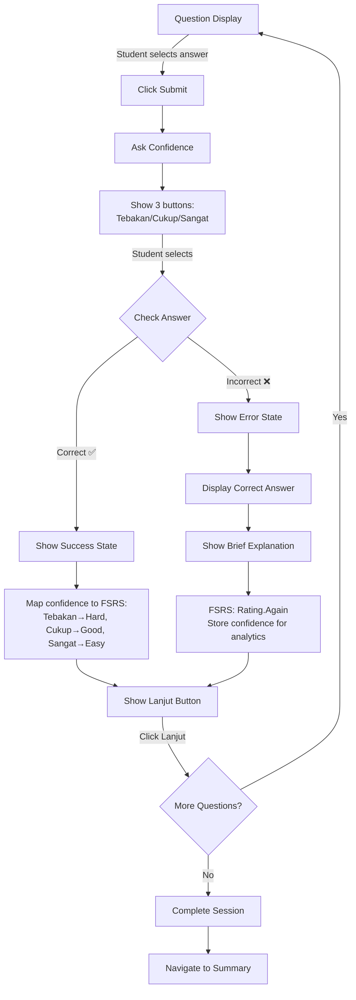

# Practice Session UI Flow & Wireframe

> **Purpose**: Guide for redesigning Practice Session UI in Figma to implement immediate feedback with confidence ratings
> 
> **Date**: December 10, 2024

---

## 🎨 **Visual Wireframes**

### **Correct Answer Feedback** ✅


### **Incorrect Answer Feedback** ❌


---

## 📋 **Summary of Changes**

### **Old Flow** (Post-Feedback - Deprecated)
```
Answer → "Benar!" or "Salah" → If correct, ask confidence → [Lanjut]
```

### **New Flow** (Pre-Feedback - Research-Based)
```
Answer → Ask confidence → Reveal "Benar!" or "Salah" → [Lanjut]
```

**Why the change?** Koriat & Bjork (2005) research shows pre-feedback confidence judgments are more accurate and free from hindsight bias.

---

## 🔄 **Complete UI Flow**



**Key Update**: Confidence is asked BEFORE revealing whether answer is correct/incorrect.

---

## 🎨 **State-by-State Wireframes**

### **State 1: Question Display** (Unchanged)

```
┌─────────────────────────────────────────────────┐
│ Soal 5 dari 15                    [Progress: 5] │
├─────────────────────────────────────────────────┤
│                                                  │
│ Tentukan nilai x dari persamaan:                │
│ 2x + 5 = 13                                      │
│                                                  │
│ ┌─────────────────┐                             │
│ │  A) x = 3       │                             │
│ └─────────────────┘                             │
│ ┌─────────────────┐                             │
│ │  B) x = 4  ✓    │ ← Selected                 │
│ └─────────────────┘                             │
│ ┌─────────────────┐                             │
│ │  C) x = 5       │                             │
│ └─────────────────┘                             │
│ ┌─────────────────┐                             │
│ │  D) x = 8       │                             │
│ └─────────────────┘                             │
│                                                  │
│              [Submit Jawaban]                    │
│                                                  │
└─────────────────────────────────────────────────┘
```

**No changes needed** - Keep existing design

---

### **State 2a: Correct Answer Feedback** ✅ (NEW)

```
┌─────────────────────────────────────────────────┐
│ Soal 5 dari 15                    [Progress: 5] │
├─────────────────────────────────────────────────┤
│                                                  │
│ ┌─────────────────────────────────────────────┐ │
│ │  ✅  Benar!                                  │ │
│ │                                              │ │
│ │  Seberapa yakin kamu dengan jawaban ini?    │ │
│ │                                              │ │
│ │  ┌──────────┐ ┌──────────┐ ┌──────────────┐│ │
│ │  │ Tebakan  │ │  Cukup   │ │ Sangat yakin ││ │
│ │  └──────────┘ └─ yakin ──┘ └──────────────┘│ │
│ │                                              │ │
│ └─────────────────────────────────────────────┘ │
│                                                  │
│                  [Lanjut]                        │
│           (disabled until selection)             │
└─────────────────────────────────────────────────┘
```

**Design Specs**:
- ✅ Success icon (Green #10b981 or brand green)
- "Benar!" heading (text-xl, font-semibold)
- Confidence question (text-base, text-gray-700)
- 3 buttons in row (wrap to column on mobile)
- [Lanjut] button disabled until confidence selected
- Light green background for success card (#f0fdf4 or similar)

---

### **State 2b: Incorrect Answer Feedback** ❌ (NEW)

```
┌─────────────────────────────────────────────────┐
│ Soal 5 dari 15                    [Progress: 5] │
├─────────────────────────────────────────────────┤
│                                                  │
│ ┌─────────────────────────────────────────────┐ │
│ │  ❌  Salah                                   │ │
│ │                                              │ │
│ │  Jawaban kamu: B) x = 4                     │ │
│ │  Jawaban yang benar: C) x = 5               │ │
│ │                                              │ │
│ │  💡 Penjelasan:                             │ │
│ │  2x + 5 = 13                                │ │
│ │  2x = 13 - 5                                │ │
│ │  2x = 8                                     │ │
│ │  x = 4                                      │ │
│ │                                              │ │
│ └─────────────────────────────────────────────┘ │
│                                                  │
│                  [Lanjut]                        │
│                 (enabled)                        │
└─────────────────────────────────────────────────┘
```

**Design Specs**:
- ❌ Error icon (Red #ef4444 or brand red)
- "Salah" heading (text-xl, font-semibold)
- User answer shown (text-base, text-gray-700)
- Correct answer highlighted (text-base, font-semibold, text-green-600)
- Explanation with 💡 icon (text-sm, text-gray-600, max 4-5 lines)
- Light red/pink background for error card (#fef2f2 or similar)
- [Lanjut] button enabled immediately (no confidence needed)

---

### **State 3: Confidence Selected** (NEW - Correct Answer Path)

```
┌─────────────────────────────────────────────────┐
│ Soal 5 dari 15                    [Progress: 5] │
├─────────────────────────────────────────────────┤
│                                                  │
│ ┌─────────────────────────────────────────────┐ │
│ │  ✅  Benar!                                  │ │
│ │                                              │ │
│ │  Seberapa yakin kamu dengan jawaban ini?    │ │
│ │                                              │ │
│ │  ┌──────────┐ ┌──────────┐ ┌──────────────┐│ │
│ │  │ Tebakan  │ │  Cukup   │ │ Sangat yakin ││ │
│ │  │          │ │  yakin ✓ │ │              ││ │
│ │  └──────────┘ └──────────┘ └──────────────┘│ │
│ │                  ↑ Selected                  │ │
│ └─────────────────────────────────────────────┘ │
│                                                  │
│                  [Lanjut]                        │
│             (now enabled)                        │
└─────────────────────────────────────────────────┘
```

**Design Specs**:
- Selected button has checkmark ✓
- Selected button style: bg-brand-color, text-white, border-2
- Unselected buttons: bg-white, text-gray-700, border
- [Lanjut] button changes from disabled to enabled state

---

## 🎯 **Component Breakdown**

### **New Components Needed**

1. **FeedbackCard** (Container)
   - Props: `type: 'success' | 'error'`
   - Background color based on type
   - Rounded corners, padding, shadow

2. **ConfidenceSelector** (Correct answer only)
   - Props: `onSelect: (level) => void`
   - State: `selected: 'tebakan' | 'cukup' | 'sangat' | null`
   - 3 buttons with visual feedback

3. **IncorrectAnswerDisplay** (Error state only)
   - Props: `userAnswer, correctAnswer, explanation`
   - Formatted display with icons

4. **LanjutButton** (Renamed from auto-advance)
   - Props: `disabled: boolean, onClick: () => void`
   - Disabled when no confidence selected (if correct)
   - Always enabled for incorrect answers

---

## 📐 **Layout Dimensions**

### **Desktop (≥768px)**
```
Feedback Card: max-width: 600px, centered
Confidence Buttons: 3 in row, 180px width each
Button spacing: gap-4
Padding: p-8
```

### **Mobile (<768px)**
```
Feedback Card: full width - 32px margin
Confidence Buttons: stacked vertically, full width
Button spacing: gap-3
Padding: p-6
```

---

## 🎨 **Design Tokens to Use**

```css
/* Success State */
--feedback-success-bg: #f0fdf4;
--feedback-success-border: #86efac;
--feedback-success-icon: #10b981;
--feedback-success-text: #065f46;

/* Error State */
--feedback-error-bg: #fef2f2;
--feedback-error-border: #fca5a5;
--feedback-error-icon: #ef4444;
--feedback-error-text: #991b1b;

/* Confidence Buttons */
--button-default-bg: #ffffff;
--button-default-border: #d1d5db;
--button-selected-bg: #f4881b; /* Brand orange */
--button-selected-text: #ffffff;

/* Lanjut Button */
--lanjut-enabled-bg: #f4881b;
--lanjut-disabled-bg: #d1d5db;
```

---

## 📱 **Interaction States**

### **Confidence Button States**
1. **Default**: Border, white background, gray text
2. **Hover**: Border thicker, slight background tint
3. **Selected**: Orange background, white text, checkmark
4. **Focus**: Ring outline for keyboard navigation

### **Lanjut Button States**
1. **Disabled**: Gray background, gray text, cursor-not-allowed
2. **Enabled**: Orange background, white text
3. **Hover (enabled)**: Darker orange
4. **Active (click)**: Even darker orange, scale(0.98)

---

## 🔄 **Animation Guidelines**

### **Feedback Card Entrance**
```css
animation: slideUp 300ms ease-out;

@keyframes slideUp {
  from {
    opacity: 0;
    transform: translateY(20px);
  }
  to {
    opacity: 1;
    transform: translateY(0);
  }
}
```

### **Confidence Selection**
```css
/* When button clicked */
transition: all 200ms ease;
/* Scale slightly on select */
transform: scale(1.05);
```

### **Lanjut Button Enable**
```css
/* When confidence selected */
transition: background-color 200ms, opacity 200ms;
```

---

## ✅ **Checklist for Figma Design**

### **Frames to Create**
- [ ] State 1: Question Display (already exists, verify)
- [ ] State 2a: Correct Answer Feedback
- [ ] State 2b: Incorrect Answer Feedback  
- [ ] State 3: Confidence Selected
- [ ] Mobile versions of all states

### **Components to Design**
- [ ] FeedbackCard (Success variant)
- [ ] FeedbackCard (Error variant)
- [ ] ConfidenceSelector (3 buttons)
- [ ] ConfidenceButton (selected/unselected states)
- [ ] IncorrectAnswerDisplay
- [ ] LanjutButton (enabled/disabled states)

### **Design Tokens to Define**
- [ ] Success colors (bg, border, icon, text)
- [ ] Error colors (bg, border, icon, text)
- [ ] Confidence button colors
- [ ] Lanjut button colors

### **Interactive Prototype**
- [ ] Link: Question Display → Feedback (on Submit click)
- [ ] Link: Confidence button → Selected state
- [ ] Link: Lanjut button → Next Question (loop back to State 1)
- [ ] Link: Last question → Session Summary

---

## 🎬 **User Flow Recording Script**

When showing this to stakeholders, demonstrate:

1. **Happy Path (Correct)**:
   - Submit answer → ✅ Benar! appears
   - Select "Cukup yakin" → Button highlights
   - Click [Lanjut] → Next question loads

2. **Learning Path (Incorrect)**:
   - Submit wrong answer → ❌ Salah appears
   - See correct answer → Read explanation
   - Click [Lanjut] → Next question loads

3. **Mobile Experience**:
   - Show stacked confidence buttons
   - Demonstrate thumb-friendly tap targets

---

## 🔗 **Next Steps**

1. **Design in Figma**:
   - Create components using this wireframe
   - Apply design tokens from Spacing System guide
   - Create mobile responsive variants

2. **Export for Development**:
   - Export component specs
   - Document component props
   - Share Figma Dev Mode link

3. **Implement in React**:
   - Create FeedbackCard component
   - Create ConfidenceSelector component
   - Update PracticeSession.tsx flow
   - Connect to backend API (with new contract)

---

**Reference Documents**:
- [PRD Section 6.3](./PRD%20–%20Math%20Deliberate%20Practice%20MVP.md) - Practice Session Flow
- [Spacing System & Design Tokens Guide](./Spacing%20System%20&%20Design%20Tokens%20Guide.md) - Design tokens
- [Pedagogy Review](./Pedagogy%20&%20Mastery%20Learning%20Review.md) - Why immediate feedback matters
